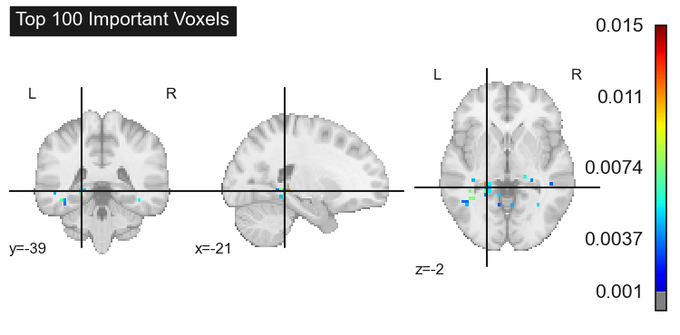

# Exploring Distributed Functional Representations with fMRI: A Modern Take on Haxby et al. (2001)

This project revisits the seminal study by [Haxby et al. (2001)](https://www.science.org/doi/10.1126/science.1063736?url_ver=Z39.88-2003&rfr_id=ori:rid:crossref.org&rfr_dat=cr_pub%20%200pubmed), which demonstrated that distributed patterns of brain activity encode information about visual stimuli. Utilizing contemporary machine learning techniques, this project replicates and extends Haxby's original findings by implementing both traditional L2-regularized logistic regression and advanced XGBoost classifiers.



## Key Areas of Exploration

- **Data Visualization:** Visualize the structure and function of fMRI data, understanding the type of data we are working with.
- **Masking Techniques:** Apply and visualize masks to focus analyses on specific brain regions, such as the ventral temporal cortex, which is critical for visual processing.
- **Feature Selection and Modeling:** Implement feature selection using ANOVA F-tests to identify the most explanatory voxels and then classify visual categories using logistic regression and XGBoost.
- **MVPA Analysis:** Decode patterns of brain activity associated with different visual categories using multivariate pattern analysis (MVPA).
- **Voxel Exclusion Analysis:** Explore the impact of excluding top explanatory voxels on decoding performance, highlighting the distributed nature of neural representations.
- **XGBoost Implementation:** Compare the performance of traditional logistic regression with XGBoost, a powerful machine learning technique, to understand the advantages of different models in decoding fMRI data.

## Project Overview

This project is divided into several key components:

1. **Data Loading and Visualization**: We begin by loading the Haxby dataset, visualizing fMRI data, and applying relevant brain masks to focus on areas of interest.
   
2. **Preprocessing and Z-Scoring**: Data is preprocessed to account for drift in the BOLD signal, with z-scoring applied separately within each run to standardize the data.

3. **Feature Selection and Classification**: 
   - **L2 Logistic Regression**: Implemented with ANOVA-based feature selection, using leave-one-run-out cross-validation to assess model performance.
   - **XGBoost**: Applied to classify visual categories with hyperparameter tuning, comparing its performance to logistic regression.

4. **Voxel Exclusion and Analysis**: We explore how removing the top explanatory voxels affects classification accuracy, reinforcing the distributed nature of brain representations.

5. **Results and Comparisons**: Confusion matrices, ROC curves, and AUC scores are generated to evaluate and compare the performance of different models and approaches.

## Running the Analysis

### Notebook Overview

All code, analysis, and results are contained within the `notebook.ipynb` file. This Jupyter Notebook includes all the steps required to replicate the analysis, from data loading and preprocessing to model training and evaluation. The notebook is self-contained, with all intermediate results saved within the notebook itself. You can re-run any part of the notebook as needed to reproduce the results or explore the data further.

## Environment Setup

To run this project, you'll need to set up the environment using the provided `environment.yml` or `requirements.txt` files. This ensures that all necessary dependencies are correctly installed.

### Using Conda

To create the environment using Conda, run:

```bash
conda env create -f environment.yml
conda activate modern_haxby2001
```

### Using Pip

Alternatively, you can set up the environment using pip:
```bash
pip install -r requirements.txt
```

### Usage

To run this project, clone the repository and execute the Jupyter Notebook. Ensure that all required Python libraries are installed, including `scikit-learn`, `xgboost`, `nilearn`, `numpy`, `scipy` and `seaborn`.
```bash
git clone https://github.com/zacharybretton/modern_haxby2001
cd modern_haxby2001
jupyter notebook
```